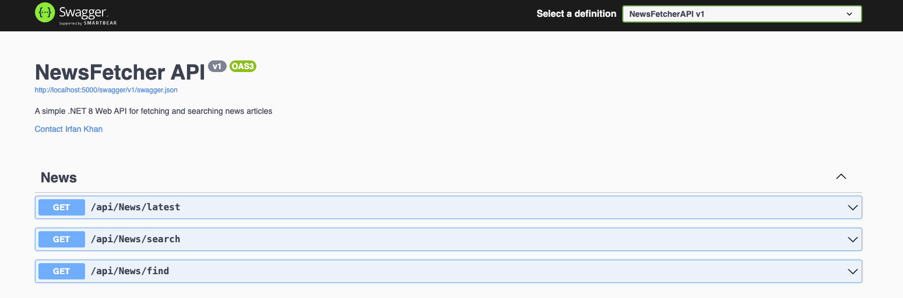

# 🚀  NewsFetcher API — HTTP & HTTPS Setup Guide

This project supports **both HTTP and HTTPS** endpoints.

## 🧭 Quick Start (Http Profile)

```bash
git clone https://github.com/irfankhan55/NewsFetcherAPI.git
cd NewsFetcherAPI
dotnet build
dotnet run
```

Open Swagger UI in your browser: [http://localhost:5000/swagger/index.html](http://localhost:5000/swagger/index.html)

[]

try any endpoint by clicking Execute Button